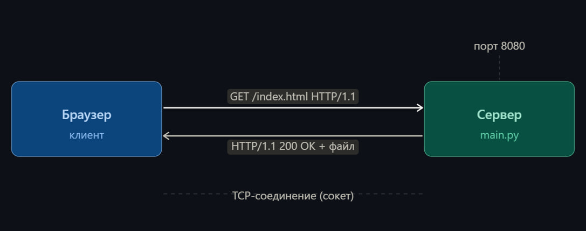
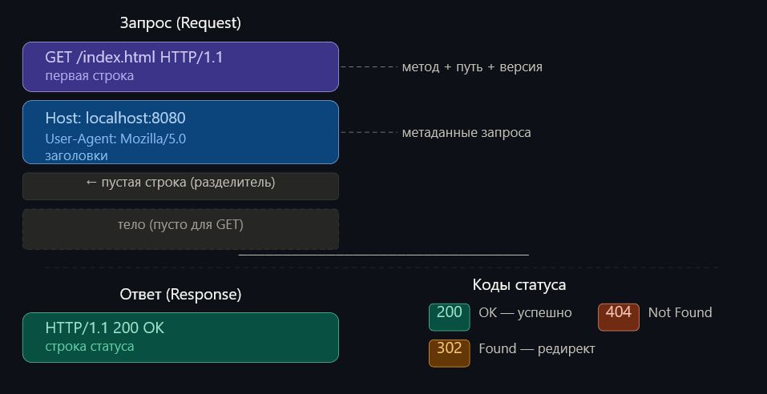
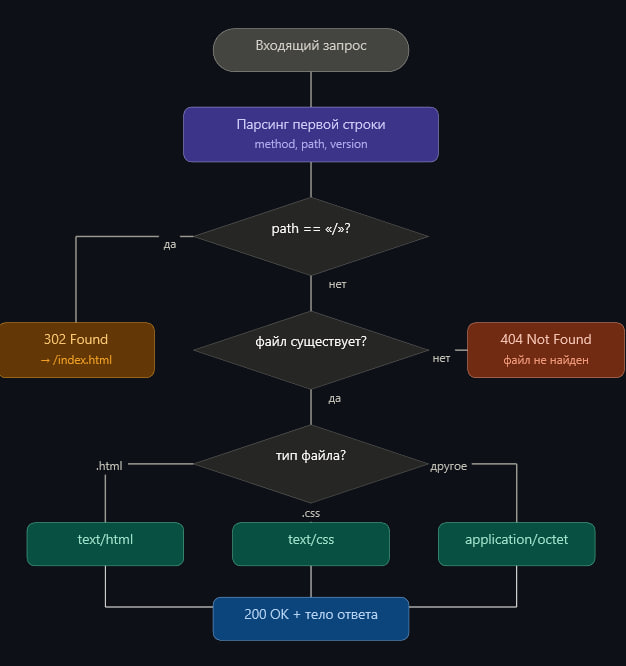

# Техническое руководство: HTTP-сервер с нуля на Python

## Введение

HTTP-сервер - это программа, которая принимает запросы от браузеров (или других клиентов) и отдаёт им файлы: HTML-страницы, картинки, стили. Именно так работает любой сайт в интернете.

В рамках вариативной части практики был реализован HTTP-сервер с нуля на Python, без использования фреймворков и готовых HTTP-библиотек. За основу взято руководство [Building a basic HTTP Server from scratch in Python](https://joaoventura.net/blog/2017/python-webserver/) Жоана Вентуры, из репозитория [codecrafters-io/build-your-own-x](https://github.com/codecrafters-io/build-your-own-x). Итоговый сервер расширен по сравнению с оригинальным гайдом.

**Стек:** Python 3, модуль `socket`, модуль `os`.

---

## 1. Как работает HTTP

HTTP (HyperText Transfer Protocol) - текстовый протокол передачи данных. Это означает, что запросы и ответы между браузером и сервером - это просто строки текста, которые передаются по сети.



### Формат HTTP-запроса

```
GET /index.html HTTP/1.1
Host: localhost:8080
User-Agent: Mozilla/5.0
```

Первая строка содержит три части:
- **Метод** (`GET`, `POST`) — что клиент хочет сделать.
- **Путь** (`/index.html`) — какой ресурс запрашивается.
- **Версия протокола** (`HTTP/1.1`).

### Формат HTTP-ответа

```
HTTP/1.1 200 OK
Content-Type: text/html; charset=utf-8

<html>...</html>
```

Ответ состоит из:
- **Строки статуса** — версия + код статуса + описание.
- **Заголовков** — метаданные (тип контента, длина и т.д.).
- **Пустой строки** — разделитель заголовков и тела.
- **Тела** — сам контент (HTML, картинка и т.д.).

### Коды статуса

| Код | Значение |
|-----|----------|
| 200 OK | Запрос выполнен успешно |
| 302 Found | Перенаправление на другой URL |
| 404 Not Found | Файл не найден |
---

---

## 2. Сокеты в Python

Сокет — это интерфейс операционной системы для отправки и получения данных по сети. Браузер и сервер общаются через TCP-сокеты: сервер открывает порт и ждёт подключений, браузер подключается и отправляет HTTP-запрос.

```python
import socket

# Создаём TCP-сокет (AF_INET = IPv4, SOCK_STREAM = TCP)
server = socket.socket(socket.AF_INET, socket.SOCK_STREAM)

# Привязываем сокет к адресу и порту
server.bind(("localhost", 8080))

# Начинаем слушать входящие подключения
server.listen(1)
```

**`AF_INET`** — семейство адресов IPv4.  
**`SOCK_STREAM`** — тип сокета TCP (надёжная передача, с подтверждением).  
**`bind()`** — говорим ОС: «этот порт — наш».  
**`listen(1)`** — количество ожидающих подключений в очереди.

---

## 3. Шаг 1 — Базовый сервер: принять соединение и ответить

Самый простой сервер: принимает любое подключение и всегда отвечает «Hello World».

```python
import socket

server = socket.socket(socket.AF_INET, socket.SOCK_STREAM)
server.bind(("localhost", 8080))
server.listen(1)
print("Server started on http://localhost:8080")

while True:
    client_socket, address = server.accept()  # ждём подключения
    request = client_socket.recv(1024).decode()  # читаем запрос
    print(request)  # выводим запрос в консоль

    response = "HTTP/1.0 200 OK\n\nHello World"
    client_socket.sendall(response.encode())
    client_socket.close()
```

**Что происходит:**
1. `server.accept()` — блокирует выполнение и ждёт, пока кто-то подключится.
2. `recv(1024)` — читает до 1024 байт запроса.
3. `sendall()` — отправляет ответ клиенту.
4. `close()` — закрывает соединение.

Если открыть браузер на `http://localhost:8080/`, увидим «Hello World».

---

## 4. Шаг 2 — Раздача HTML-файла

Теперь вместо «Hello World» читаем и отдаём реальный HTML-файл. Также парсим первую строку запроса, чтобы узнать, какой файл запрашивает браузер.

```python
while True:
    client_socket, address = server.accept()
    request = client_socket.recv(1024).decode()

    # Парсим первую строку запроса: "GET /index.html HTTP/1.1"
    lines = request.split("\n")
    first_line = lines[0]
    method, path, version = first_line.split()

    # По умолчанию — отдаём index.html
    if path == "/":
        path = "/index.html"

    # Читаем файл
    with open("site" + path, "r", encoding="utf-8") as f:
        content = f.read()

    response = "HTTP/1.0 200 OK\n\n" + content
    client_socket.sendall(response.encode())
    client_socket.close()
```

**Ключевой момент:** `first_line.split()` разбивает строку `"GET /index.html HTTP/1.1"` на три части: метод, путь и версию.

---

## 5. Шаг 3 — Обработка ошибки 404

Если запрошенного файла нет — сервер падал с `FileNotFoundError`. Нужно перехватить ошибку и отправить правильный ответ:

```python
try:
    with open("site" + path, "r", encoding="utf-8") as f:
        content = f.read()
    response = "HTTP/1.0 200 OK\n\n" + content
except FileNotFoundError:
    response = "HTTP/1.0 404 Not Found\n\n404 - File Not Found"

client_socket.sendall(response.encode())
client_socket.close()
```

Теперь при запросе несуществующей страницы браузер получит корректный ответ, а сервер продолжит работу.

---

## 6. Модификация — расширенный сервер

Базовый сервер из гайда умеет отдавать только HTML. Реальный сайт состоит из HTML, CSS, изображений, видео. Была проведена модификация: сервер расширен для работы с файлами разных типов.

### 6.1. Правильные заголовки Content-Type

Браузер использует заголовок `Content-Type`, чтобы понять, как интерпретировать ответ. Без него CSS не будет применяться, изображения не отобразятся.

```python
if file_path.endswith(".html"):
    content_type = "text/html; charset=utf-8"
    with open(file_path, "r", encoding="utf-8") as f:
        body = f.read().encode()

elif file_path.endswith(".css"):
    content_type = "text/css"
    with open(file_path, "r", encoding="utf-8") as f:
        body = f.read().encode()

else:
    # Бинарные файлы: изображения, видео
    content_type = "application/octet-stream"
    with open(file_path, "rb") as f:
        body = f.read()

response = (
    f"HTTP/1.1 200 OK\r\n"
    f"Content-Type: {content_type}\r\n"
    f"\r\n"
).encode() + body
```

**Важно:** бинарные файлы открываются в режиме `"rb"` (read binary), а не `"r"`, иначе Python попытается декодировать байты как текст и получит ошибку.

### 6.2. Редирект 302

При заходе на `http://localhost:8080/` браузер получает пустой путь `/`. Редирект отправляет его на `/index.html`:

```python
if path == "/":
    response = (
        "HTTP/1.1 302 Found\r\n"
        "Location: /index.html\r\n"
        "\r\n"
    )
    client_socket.send(response.encode())
```

Браузер автоматически повторяет запрос на новый адрес из заголовка `Location`.

### 6.3. Обработка POST-запросов

POST-запрос отличается от GET тем, что содержит тело с данными (например, данные формы). Тело отделено от заголовков пустой строкой `\r\n\r\n`:

```python
if method == "POST":
    body_data = request.split("\r\n\r\n")[1]
    print("POST data:", body_data)
```

### 6.4. Полный код итогового сервера

```python
import socket
import os

server = socket.socket(socket.AF_INET, socket.SOCK_STREAM)
server.bind(("localhost", 8080))
server.listen(1)
print("Server started on http://localhost:8080")

while True:
    base_dir = os.path.dirname(os.path.abspath(__file__))
    site_dir = os.path.join(base_dir, "..", "site")
    client_socket, address = server.accept()

    request = client_socket.recv(1024).decode()
    lines = request.split("\n")
    first_line = lines[0]
    method, path, version = first_line.split()

    if path == "/":
        response = (
            "HTTP/1.1 302 Found\r\n"
            "Location: /index.html\r\n"
            "\r\n"
        )
        client_socket.send(response.encode())

    elif os.path.isfile(os.path.join(site_dir, path[1:])):
        file_path = os.path.join(site_dir, path[1:])

        if file_path.endswith(".html"):
            content_type = "text/html; charset=utf-8"
            with open(file_path, "r", encoding="utf-8") as f:
                body = f.read().encode()
        elif file_path.endswith(".css"):
            content_type = "text/css"
            with open(file_path, "r", encoding="utf-8") as f:
                body = f.read().encode()
        else:
            content_type = "application/octet-stream"
            with open(file_path, "rb") as f:
                body = f.read()

        response = (
            f"HTTP/1.1 200 OK\r\n"
            f"Content-Type: {content_type}\r\n"
            f"\r\n"
        ).encode() + body
        client_socket.send(response)

    else:
        response = (
            "HTTP/1.1 404 Not Found\r\n"
            "\r\n"
            "404"
        )
        client_socket.send(response.encode())

    if method == "POST":
        body_data = request.split("\r\n\r\n")[1]
        print("POST data:", body_data)

    client_socket.close()
```

---
## 7. Источники

1. João Ventura — [Building a basic HTTP Server from scratch in Python](https://joaoventura.net/blog/2017/python-webserver/)
2. codecrafters-io — [Build your own X](https://github.com/codecrafters-io/build-your-own-x)
3. Python docs — [socket — Low-level networking interface](https://docs.python.org/3/library/socket.html)
4. MDN Web Docs — [HTTP](https://developer.mozilla.org/ru/docs/Web/HTTP)
